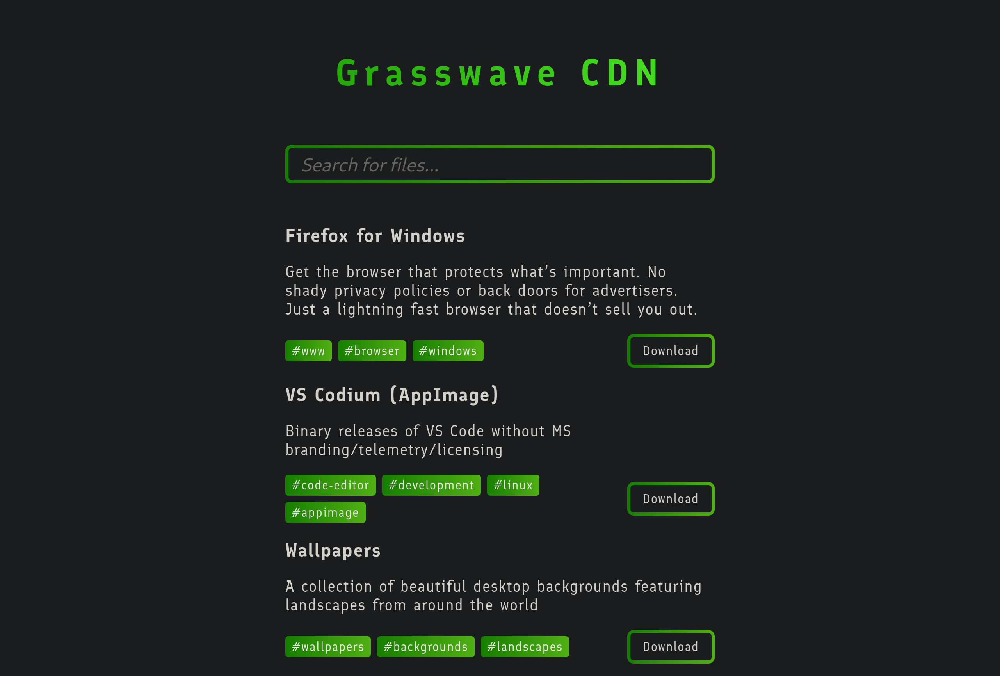
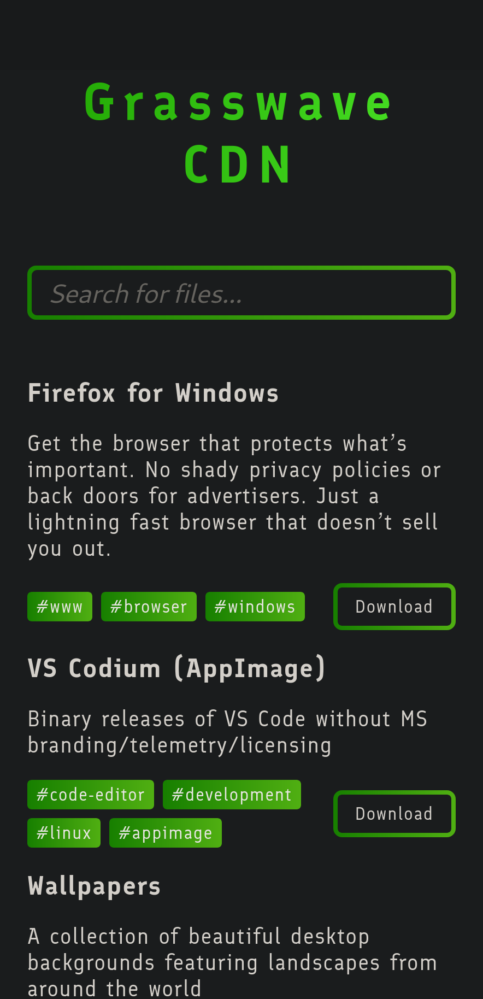
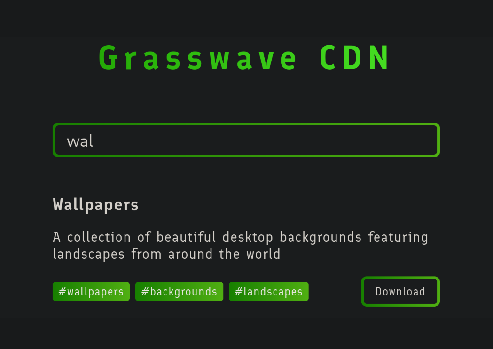
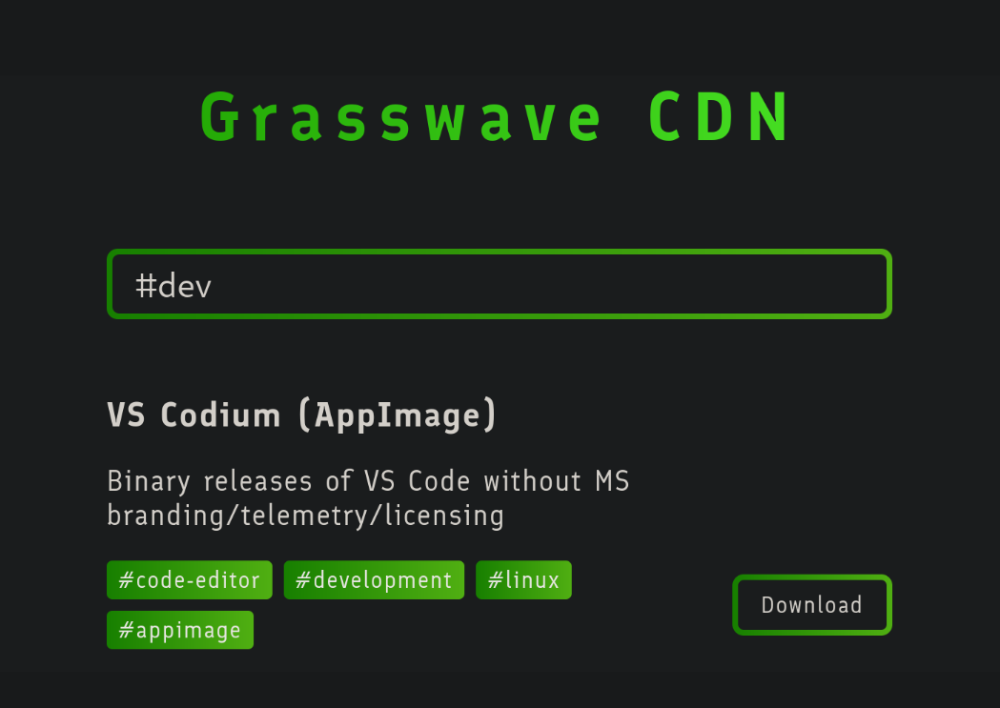

# Grasswave CDN
A stupidly simple and easy to self-host, personal server for file hosting on the web. Written in Rust.

Thanks, [@Maciejowski](https://github.com/maciejowski2006/), for the stylesheet!

## Screenshots


<details>
    <summary>Show more</summary>
    <h3>Mobile layout</h3>
    
    <h3>Search</h3>
    
    <h3>Tag search</h3>
    
    </details>

## How to use
For every file you want to publish, create a seperate directory in the `files` folder, and place the files inside of them. In every directory, create a file named `info.toml`.
```
files
├── lorem
│   ├── lorem.tar.xz
│   └── info.toml
├── ipsum
│   ├── info.toml
│   └── ipsum.tar.xz
└── dolor
    ├── info.toml
    └── dolor.tar.xz
```
In the toml files, set the name and description to display, and the name of the file to publish, in the following format:
```toml
name = "Lorem"
description = "Lorem ipsum dolor sit amet"
tags = ["lorem", "ipsum", "dolor"]
path = "lorem.tar.xz"
```
Run the executable, and that's it! You can visit it in the browser at the link displayed in the terminal.

You can configure it in a config file created automatically on the first run.

<details>
<summary>Default config</summary>

```toml
displayed_name = "Grasswave CDN"
files_path = "files"
accent_colors = ["#1D9F00", "#4DE928"]
http_port = 7000
```
</details>
